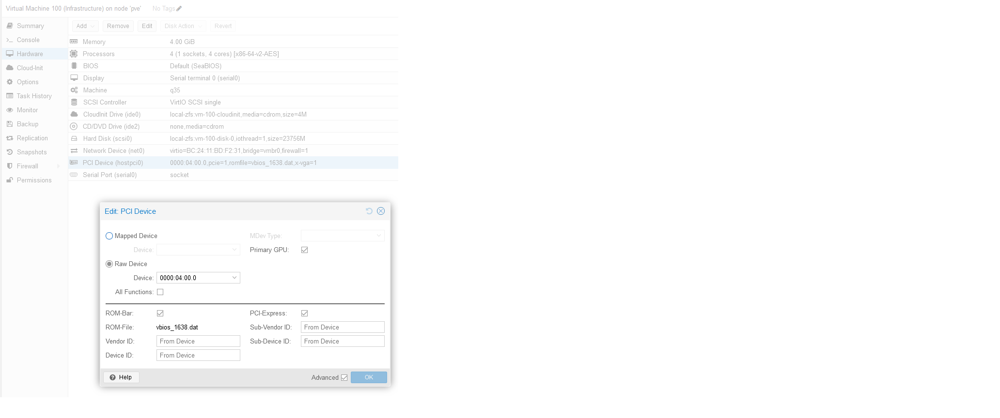

## Hardware

- CP: AMD Ryzen 7 5700G
- MB: Gigabyte Aorus 550M Elite

## Grub Command Line
 
```quiet iommu=pt initcall_blacklist=sysfb_init```

## Modules

in `/etc/modules add:`

```
vfio
vfio_pci
vfio_viqfd
vfio_iommu_type1
```

## Blacklist

```
echo "blacklist amdgpu" >> /etc/modprobe.d/blacklist.conf
echo "blacklist radeon" >> /etc/modprobe.d/blacklist.conf
```
```
update-initramfs -u -k all
```

## PCI ID's

```
root@pve:~# lspci -nnk

00:00.0 Host bridge [0600]: Advanced Micro Devices, Inc. [AMD] Renoir/Cezanne Root Complex [1022:1630]
        Subsystem: Advanced Micro Devices, Inc. [AMD] Renoir/Cezanne Root Complex [1022:1630]
00:00.2 IOMMU [0806]: Advanced Micro Devices, Inc. [AMD] Renoir/Cezanne IOMMU [1022:1631]
        Subsystem: Advanced Micro Devices, Inc. [AMD] Renoir/Cezanne IOMMU [1022:1631]
00:01.0 Host bridge [0600]: Advanced Micro Devices, Inc. [AMD] Renoir PCIe Dummy Host Bridge [1022:1632]
00:02.0 Host bridge [0600]: Advanced Micro Devices, Inc. [AMD] Renoir PCIe Dummy Host Bridge [1022:1632]
00:02.1 PCI bridge [0604]: Advanced Micro Devices, Inc. [AMD] Renoir/Cezanne PCIe GPP Bridge [1022:1634]
        Subsystem: Advanced Micro Devices, Inc. [AMD] Renoir/Cezanne PCIe GPP Bridge [1022:1453]
        Kernel driver in use: pcieport
00:08.0 Host bridge [0600]: Advanced Micro Devices, Inc. [AMD] Renoir PCIe Dummy Host Bridge [1022:1632]
00:08.1 PCI bridge [0604]: Advanced Micro Devices, Inc. [AMD] Renoir Internal PCIe GPP Bridge to Bus [1022:1635]
        Subsystem: Advanced Micro Devices, Inc. [AMD] Renoir Internal PCIe GPP Bridge to Bus [1022:1635]
        Kernel driver in use: pcieport
00:14.0 SMBus [0c05]: Advanced Micro Devices, Inc. [AMD] FCH SMBus Controller [1022:790b] (rev 51)
        Subsystem: Gigabyte Technology Co., Ltd FCH SMBus Controller [1458:5001]
        Kernel modules: i2c_piix4, sp5100_tco
00:14.3 ISA bridge [0601]: Advanced Micro Devices, Inc. [AMD] FCH LPC Bridge [1022:790e] (rev 51)
        Subsystem: Gigabyte Technology Co., Ltd FCH LPC Bridge [1458:5001]
00:18.0 Host bridge [0600]: Advanced Micro Devices, Inc. [AMD] Cezanne Data Fabric; Function 0 [1022:166a]
00:18.1 Host bridge [0600]: Advanced Micro Devices, Inc. [AMD] Cezanne Data Fabric; Function 1 [1022:166b]
00:18.2 Host bridge [0600]: Advanced Micro Devices, Inc. [AMD] Cezanne Data Fabric; Function 2 [1022:166c]
00:18.3 Host bridge [0600]: Advanced Micro Devices, Inc. [AMD] Cezanne Data Fabric; Function 3 [1022:166d]
        Kernel driver in use: k10temp
        Kernel modules: k10temp
00:18.4 Host bridge [0600]: Advanced Micro Devices, Inc. [AMD] Cezanne Data Fabric; Function 4 [1022:166e]
00:18.5 Host bridge [0600]: Advanced Micro Devices, Inc. [AMD] Cezanne Data Fabric; Function 5 [1022:166f]
00:18.6 Host bridge [0600]: Advanced Micro Devices, Inc. [AMD] Cezanne Data Fabric; Function 6 [1022:1670]
00:18.7 Host bridge [0600]: Advanced Micro Devices, Inc. [AMD] Cezanne Data Fabric; Function 7 [1022:1671]
01:00.0 USB controller [0c03]: Advanced Micro Devices, Inc. [AMD] 500 Series Chipset USB 3.1 XHCI Controller [1022:43ee]
        Subsystem: ASMedia Technology Inc. ASM1042A USB 3.0 Host Controller [1b21:1142]
        Kernel driver in use: xhci_hcd
        Kernel modules: xhci_pci
01:00.1 SATA controller [0106]: Advanced Micro Devices, Inc. [AMD] 500 Series Chipset SATA Controller [1022:43eb]
        Subsystem: ASMedia Technology Inc. ASM1062 Serial ATA Controller [1b21:1062]
        Kernel driver in use: ahci
        Kernel modules: ahci
01:00.2 PCI bridge [0604]: Advanced Micro Devices, Inc. [AMD] 500 Series Chipset Switch Upstream Port [1022:43e9]
        Subsystem: ASMedia Technology Inc. 500 Series Chipset Switch Upstream Port [1b21:0201]
        Kernel driver in use: pcieport
02:09.0 PCI bridge [0604]: Advanced Micro Devices, Inc. [AMD] Device [1022:43ea]
        Subsystem: ASMedia Technology Inc. Device [1b21:3308]
        Kernel driver in use: pcieport
03:00.0 Ethernet controller [0200]: Realtek Semiconductor Co., Ltd. RTL8111/8168/8411 PCI Express Gigabit Ethernet Controller [10ec:8168] (rev 15)
        Subsystem: Gigabyte Technology Co., Ltd Onboard Ethernet [1458:e000]
        Kernel driver in use: r8169
        Kernel modules: r8169
04:00.0 VGA compatible controller [0300]: Advanced Micro Devices, Inc. [AMD/ATI] Cezanne [Radeon Vega Series / Radeon Vega Mobile Series] [1002:1638] (rev c8)
        Subsystem: Gigabyte Technology Co., Ltd Cezanne [Radeon Vega Series / Radeon Vega Mobile Series] [1458:d000]
        Kernel driver in use: vfio-pci
        Kernel modules: amdgpu
04:00.1 Audio device [0403]: Advanced Micro Devices, Inc. [AMD/ATI] Renoir Radeon High Definition Audio Controller [1002:1637]
        Subsystem: Advanced Micro Devices, Inc. [AMD/ATI] Renoir Radeon High Definition Audio Controller [1002:1637]
        Kernel driver in use: snd_hda_intel
        Kernel modules: snd_hda_intel
04:00.2 Encryption controller [1080]: Advanced Micro Devices, Inc. [AMD] Family 17h (Models 10h-1fh) Platform Security Processor [1022:15df]
        Subsystem: Advanced Micro Devices, Inc. [AMD] Family 17h (Models 10h-1fh) Platform Security Processor [1022:15df]
        Kernel driver in use: ccp
        Kernel modules: ccp
04:00.3 USB controller [0c03]: Advanced Micro Devices, Inc. [AMD] Renoir/Cezanne USB 3.1 [1022:1639]
        Subsystem: Gigabyte Technology Co., Ltd Renoir/Cezanne USB 3.1 [1458:5007]
        Kernel driver in use: xhci_hcd
        Kernel modules: xhci_pci
04:00.4 USB controller [0c03]: Advanced Micro Devices, Inc. [AMD] Renoir/Cezanne USB 3.1 [1022:1639]
        Subsystem: Gigabyte Technology Co., Ltd Renoir/Cezanne USB 3.1 [1458:5007]
        Kernel driver in use: xhci_hcd
        Kernel modules: xhci_pci
04:00.6 Audio device [0403]: Advanced Micro Devices, Inc. [AMD] Family 17h/19h HD Audio Controller [1022:15e3]
        DeviceName: Realtek ALC1220
        Subsystem: Gigabyte Technology Co., Ltd Family 17h/19h HD Audio Controller [1458:a194]
        Kernel driver in use: snd_hda_intel
        Kernel modules: snd_hda_intel
```
        
`iGPU PCI ID	0000:04:00.0
device id 1002:1638`

## Loading vfio modules

nano `/etc/modprobe.d/pt.conf`
add:

```
options vfio-pci ids=1002:1638
#options vfio-pci disable_idle_d3=1
```

```
update-initramfs -u -k all
```

## VM



cat `/etc/pve/qemu-server/100.conf`

```
#192.168.1.69
agent: 1
boot: order=scsi0
cipassword: #############
ciuser: ansible
cores: 4
cpu: x86-64-v2-AES
hostpci0: 0000:04:00.0,pcie=1,romfile=vbios_1638.dat,x-vga=1
ide0: local-zfs:vm-100-cloudinit,media=cdrom,size=4M
ide2: none,media=cdrom
ipconfig0: ip=dhcp
machine: q35
memory: 4096
meta: creation-qemu=9.0.2,ctime=1732963041
name: Infrastructure
nameserver: 8.8.8.8 1.1.1.1
net0: virtio=BC:24:11:BD:F2:31,bridge=vmbr0,firewall=1
numa: 0
onboot: 1
ostype: l26
parent: snap1
scsi0: local-zfs:vm-100-disk-0,iothread=1,size=23756M
scsihw: virtio-scsi-single
searchdomain: #############
serial0: socket
smbios1: uuid=5160cd4f-78bf-415d-8892-a054fe3e4758
sockets: 1
sshkeys: #############
vmgenid: 0d925793-ba2e-428c-a18a-dce241a2f55f
```


## Guest Ubuntu AMD Drivers Install

```
wget https://repo.radeon.com/rocm/rocm.gpg.key -O - | gpg --dearmor | sudo tee /etc/apt/keyrings/rocm.gpg > /dev/null

echo "deb [arch=amd64 signed-by=/etc/apt/keyrings/rocm.gpg] https://repo.radeon.com/amdgpu/6.0.2/ubuntu jammy main"     | sudo tee /etc/apt/sources.list.d/amdgpu.list

sudo apt update
sudo apt install amdgpu-dkms
reboot
```
```
lsmod | grep gpu
amdgpu              14749696  0
amddrm_ttm_helper      16384  1 amdgpu
amdttm                 94208  2 amdgpu,amddrm_ttm_helper
amdxcp                 16384  1 amdgpu
amddrm_buddy           20480  1 amdgpu
amd_sched              49152  1 amdgpu
amdkcl                 40960  3 amd_sched,amdttm,amdgpu
i2c_algo_bit           16384  1 amdgpu
drm_kms_helper        311296  2 amdgpu
drm                   622592  9 drm_kms_helper,amd_sched,amdttm,amdgpu,amddrm_buddy,amdkcl,amddrm_ttm_helper,amdxcp
```

```
[...]
01:00.0 VGA compatible controller [0300]: Advanced Micro Devices, Inc. [AMD/ATI] Cezanne [1002:1638] (rev c8)
        Subsystem: Gigabyte Technology Co., Ltd Cezanne [1458:d000]
        Kernel driver in use: amdgpu
        Kernel modules: amdgpu
[...]
```

```
ls /dev/dri/
by-path  card0  renderD128
```

```
vainfo
error: can't connect to X server!
libva info: VA-API version 1.14.0
libva info: Trying to open /usr/lib/x86_64-linux-gnu/dri/radeonsi_drv_video.so
libva info: Found init function __vaDriverInit_1_14
libva info: va_openDriver() returns 0
vainfo: VA-API version: 1.14 (libva 2.12.0)
vainfo: Driver version: Mesa Gallium driver 23.2.1-1ubuntu3.1~22.04.2 for RENOIR (renoir, LLVM 15.0.7, DRM 3.56, 5.15.0-126-generic)
vainfo: Supported profile and entrypoints
      VAProfileMPEG2Simple            : VAEntrypointVLD
      VAProfileMPEG2Main              : VAEntrypointVLD
      VAProfileVC1Simple              : VAEntrypointVLD
      VAProfileVC1Main                : VAEntrypointVLD
      VAProfileVC1Advanced            : VAEntrypointVLD
      VAProfileH264ConstrainedBaseline: VAEntrypointVLD
      VAProfileH264ConstrainedBaseline: VAEntrypointEncSlice
      VAProfileH264Main               : VAEntrypointVLD
      VAProfileH264Main               : VAEntrypointEncSlice
      VAProfileH264High               : VAEntrypointVLD
      VAProfileH264High               : VAEntrypointEncSlice
      VAProfileHEVCMain               : VAEntrypointVLD
      VAProfileHEVCMain               : VAEntrypointEncSlice
      VAProfileHEVCMain10             : VAEntrypointVLD
      VAProfileHEVCMain10             : VAEntrypointEncSlice
      VAProfileJPEGBaseline           : VAEntrypointVLD
      VAProfileVP9Profile0            : VAEntrypointVLD
      VAProfileVP9Profile2            : VAEntrypointVLD
      VAProfileNone                   : VAEntrypointVideoProc
```

## Sources

https://www.bilibili.com/video/BV11d4y1G7Nk/

https://gist.github.com/matt22207/bb1ba1811a08a715e32f106450b0418a

https://github.com/isc30/ryzen-7000-series-proxmox


